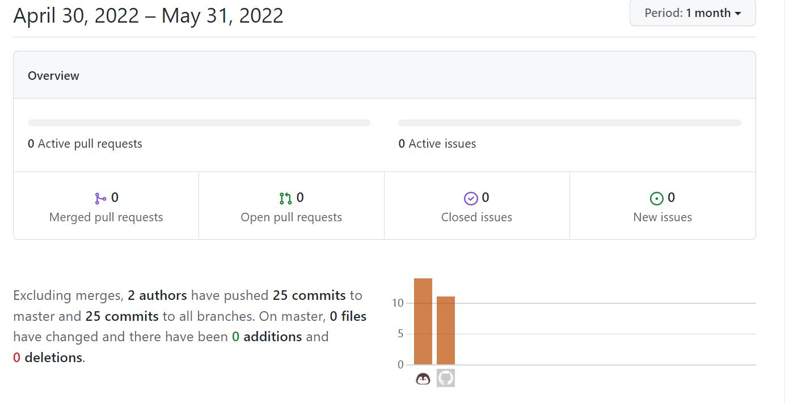




# microC
---
- 课程名称：编程语言原理与编译
- 实验项目：期末大作业
- 专业班级：计算机1904
- 学生学号：31901121，31901115
- 学生姓名：余溢轩，王嵊栋
- 实验指导教师: 张芸

## 简介


​		编译原理是对高级程序语言进行翻译的一门科学技术，内容包括语言和文法、词法分析、语法分析、语法制导分析、中间代码生成、存储管理、代码优化和目标代码生成。虽然仅有少数人会专门从事该方向的工作，但对每一个计算机学子来说理解程序语言背后运行的逻辑过程仍然是十分重要的。在接受了相关原理性质和高度抽象的知识后，为了进一步地理解和运用编译原理的知识，我们使用F#来制作一门新的语言。


## 结构
- 前端：由`F#`语言编写而成
  - `CLex.fsl`生成的`CubyLex.fs`词法分析器。
  - `CPar.fsy`生成的`CubyPar.fs`语法分析器。
  - `Absyn.fs` 定义了抽象语法树
  - `Comp.fs`将抽象语法树转化为中间表示
  
- 后端：由`Java`语言编写而成
  - `Machine.java`生成`Machine.class`虚拟机与`Machinetrace.class`堆栈追踪

- 测试集：测试程序放在`test`文件夹内

- 库：`.net`支持
  - `FsLexYacc.Runtime.dll`
## 用法

- ```sh
  dotnet "C:\Users\自己的用户名\.nuget\packages\fslexyacc\10.2.0\build\fslex\netcoreapp3.1\fslex.dll" -o "CLex.fs" --module CLex --unicode CLex.fsl
  ```
  
  生成`CubyLex.fs`词法分析器
  
  
  
- ```sh
  dotnet "C:\Users\自己的用户名\.nuget\packages\fslexyacc\10.2.0\build\fsyacc\netcoreapp3.1\fsyacc.dll" -o "CPar.fs" --module CPar  CPar.fsy`  
  ```
  
  生成`CubyPar.fs`语法分析器与`CubyPar.fsi`
  
  
  
- `javac Machine.java`  
  生成虚拟机

  
  
- 运行解释器器
  
  ```sh
  # 编译解释器 interpc.exe 命令行程序 
  dotnet restore  interpc.fsproj   
  dotnet clean  interpc.fsproj
  dotnet build -v n interpc.fsproj
  
  # 执行解释器
  dotnet run --project interpc.fsproj ./example/if.c 8
  dotnet run --project interpc.fsproj ./example/if.c 8  //显示token AST 等调试信息
  ```
  
- 运行编译器
  
  ```sh
  # 构建 microc.exe 编译器程序 
  dotnet restore  microc.fsproj 
  dotnet clean  microc.fsproj   
  dotnet build  microc.fsproj  
  
  dotnet run --project microc.fsproj example/if.c   
  dotnet run --project microc.fsproj -g example/if.c   # -g 查看调试信息
  
  
  dotnet built -t:ccrun microc.fsproj     # 编译并运行 example 目录下多个文件
  dotnet built -t:cclean microc.fsproj    # 清除生成的文件
  
  ```
  
  

虚拟机功能：
- `java Machine` 运行中间表示
- `java Machinetrace` 追踪堆栈变化
例子：
```bash
java Machine ./example/if.out 1
java Machinetrace ./example/if.out 1
```

## 功能实现
1:自加加 
  语法树:
    .jpg)
  运行结果:
    .1.jpg)
2:自减减
  语法树:
  .jpg)
  运行结果:
  .1.jpg)
3:break
  语法树:
  .jpg)
  运行结果:
  .1.jpg)
4:continue
  语法树:
  .jpg)
  运行结果:
  .1.jpg)
5:switch
  语法树:
  .jpg)
  运行结果:
  .1.jpg)

## 心得体会
- 余溢轩：  
  本学期的编译原理大作业，对我而言有难度，需要投入大量的时间去学习，了解本质的东西。但这完成大作业的过程，我对编译原理课程的认识更加深刻，掌握的东西也更加多了。
  - 了解了函数式编程的语言特点与特性，拓宽视野。
  - 利用F#与java完善了一个编程语言的从前端到后端的完整的搭建
  - 清楚了一些关于C语言的设计方法与局限性。
  - 理解了栈式虚拟机的工作原理与一些设计方法
  - 利用虚拟机避免与汇编指令集直接打交道，优化代码执行策略

  时间太紧了，如果时间再多一点的话，还可以往虚拟机中加入全局静态变量表、完善结构体、加入头文件机制、加入输入模块等。  
  总而言之，这节编译原理课，收获颇丰，F#好用值得学习。编译原理的世界还是相当有趣的。

- 王嵊栋：  
  这个学期的编译原理大作业，我学习到了很多，理解了基本编译原理，对其他语言也有了一些理解。
  总结一下
  - 大作业完成中，对指令与栈结构有了更深的了解
  - 随着对fsharp的使用越加频繁，也加深了对函数式编程语言的印象
  - 过程的积累中，逐渐了解一些编译的理念，计算的思维。
  - 在大作业有些功能的完成上，还可以再优化精简。时间足够的话还要继续完善更多的异常处理功能，可以增加一些面向对象的思想在里面，对虚拟机的支持要求更高，也可以做些关于垃圾回收的功能。


## 技术评价

| 功能 | 对应文件 | 优  | 良  | 中  |
| ---- | -------- | --- | --- | --- |
|变量声明定义|ex(init).c|√|||
|自增、自减|ex(selfplus).c|√|||
|for循环|ex(for).c|√|||
|while|ex(while).c|√|||
|break|ex(break).c|√|||
|continue|ex(continue).c|√|||
|switch-case|ex(switch).c|√|||

## 小组分工

- 余溢轩
  - 学号：31901121
  - 班级：计算机1904
    - 工作内容
      - 文档编写
      - 测试程序
      - 主要负责虚拟机和中间代码生成
- 王嵊栋
  - 学号：31901115
  - 班级：计算机1904
    - 工作内容
      - 文档编写
      - 测试程序
      - 语法分析
      - 词法分析

- 权重分配表：

| 余溢轩 | 王嵊栋 |
| ---- | ---- |
| 0.95 | 0.95 |

提交记录：


